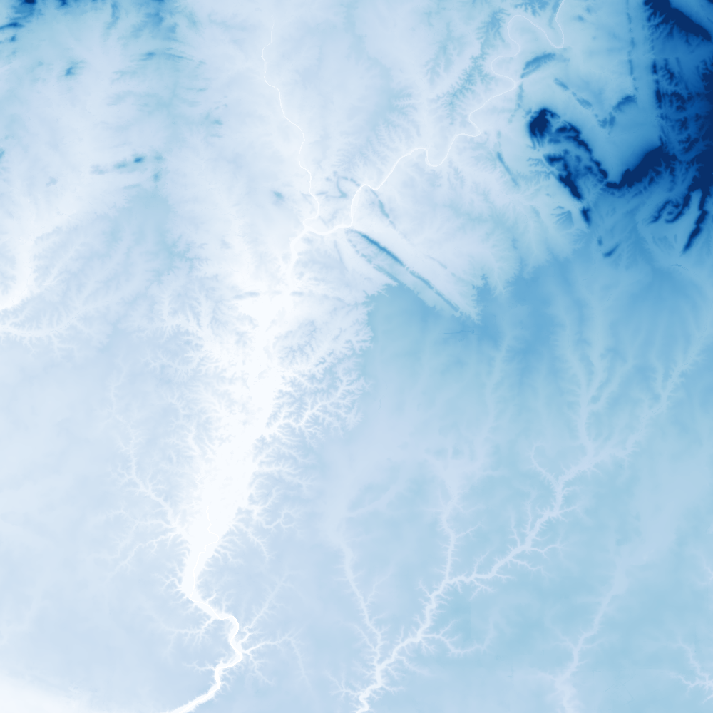

# Zarr Data API Documentation

This API provides access to geospatial data stored in Zarr format. It allows
you to retrieve data tiles, metadata, and perform spatial operations without
needing to understand the internal implementation details.

## Understanding Path Parameters

Throughout this API, the `path` parameter refers to the Zarr prefix in S3,
excluding the protocol and bucket name.

For example, if your Zarr dataset is stored at:
```
s3://vizlab-geodatalake-exports/my-cool-zarr.zarr
```

Then the `path` parameter would be:
```
my-cool-zarr
```

If instead your Zarr dataset is stored at:
```
s3://my-custom-nautilus-bucket/my-cool-zarr.zarr
```

Then the `path` parameter would still be:
```
my-cool-zarr
```

but you would append the query param `&bucket=my-custom-nautilus-bucket`

## Available Endpoints

https://zarr-server.nrp-nautilus.io/docs

## Example Usage

Retrieve a colored tile for elevation data:
```
curl -X 'GET' \
  'https://zarr-server.nrp-nautilus.io/caribbean-elevation2/topobathy/FABDEM_ACA_raw/51/112/color/Blues/vmin/20/vmax/200.png?bucket=cl-lake-test' \
  -H 'accept: application/json'
```


